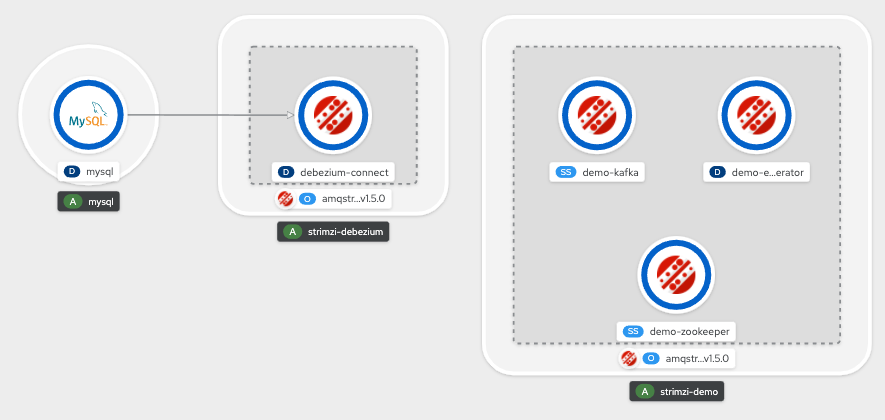
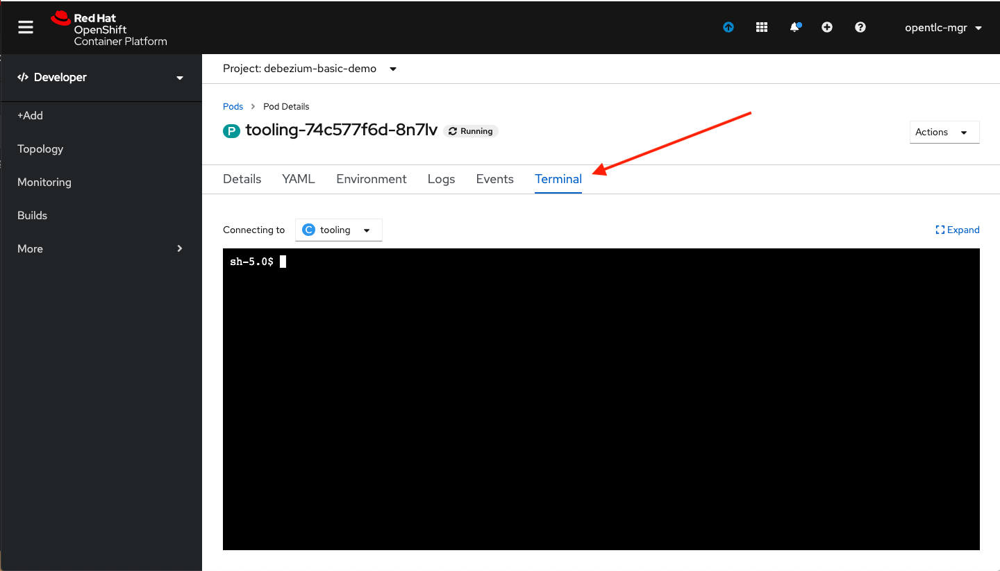

// versions
:debezium: 1.1
:streams: 1.5
:camel-kafka-connectors: 0.4.0

// URLs
//:fuse-documentation-url: https://access.redhat.com/documentation/en-us/red_hat_fuse/{fuse-version}/
:openshift-console-url: {openshift-host}/topology/ns/debezium-basic-demo/graph

// attributes
:title: Introducing Debezium
:standard-fail-text: Verify that you followed all the steps. If you continue to have issues, contact your administrator.

// id syntax is used here for the custom IDs
[id='debezium-basic-demo']
= {title}

// Description text for the Solution Pattern.
This tutorial demonstrates how to use Debezium to monitor a MySQL database. As the data in the database changes, you will see the resulting event in AMQ streams.

// Additional introduction content.
Debezium is a distributed platform that turns your existing databases into event streams, so applications can see and respond immediately to each row-level change in the databases.

Debezium is built on top of Apache Kafka and provides Kafka Connect compatible connectors that monitor specific database management systems. Debezium records the history of data changes in Kafka logs, from where your application consumes them. This makes it possible for your application to easily consume all of the events correctly and completely. Even if your application stops unexpectedly, it will not miss anything: when the application restarts, it will resume consuming the events where it left off.

image::images/debezium-basic.png[Debezium, role="integr8ly-img-responsive"]

Debezium includes multiple connectors. In this tutorial, you will use the MySQL connector. The example database, a one node Kafka cluster and a Kafka Connect cluster with the MySQL connector are already deployed in the working namespace.

[type=walkthroughResource,serviceName=openshift]
.Red Hat OpenShift
****
* link:{openshift-console-url}[Console, window="_blank"]
* link:https://docs.openshift.com/dedicated/4/welcome/index.html/[OpenShift Documentation, window="_blank"]
* link:https://blog.openshift.com/[OpenShift Blog, window="_blank"]
****
// <-- END OF SOLUTION PATTERN GENERAL INFO -->

// <-- START OF SOLUTION PATTERN TASKS -->
[time=5]
[id='starting-mysql-client']
== Starting a MySQL command line client

The first step is to start a MySQL command line client in the tooling terminal so that you can access the sample `inventory` database.
 
=== Access the tooling terminal

. Open a new browser tab and go to the link:{openshift-console-url}[topology view, window="_blank"]
+
[NOTE]
====
If you haven't done so, change from the Administrator to the Developer view on the top left menu.
====

. Click on the `tooling` pod to open the right panel and then click on the pod name.
+
image::images/tooling-topology.png[Tooling, role="integr8ly-img-responsive"]

. Click on the `terminal` tab to get access to the working terminal.
+

=== Explore the database

. Use the terminal to start the MySQL command line client in the container. Log into the sample `inventory` database.
+
[source,bash,subs="attributes+"]
----
mycli -h mysql -u mysqluser -p mysqlpw inventory
----
+
You should see output similar to the following:
+
[source,bash,subs="attributes+"]
----
mysql 5.7.30-log
mycli 1.20.1
Chat: https://gitter.im/dbcli/mycli
Mail: https://groups.google.com/forum/#!forum/mycli-users
Home: http://mycli.net
Thanks to the contributor - Magnus udd
mysql mysqluser@mysql:inventory>
----

. At the `mysql mysqluser@mysql:inventory>` command prompt, list the tables in the database:
+
[source,bash,subs="attributes+"]
----
show tables;
----
+
You will get the following output:
+
[source,bash,subs="attributes+"]
----
+---------------------+
| Tables_in_inventory |
+---------------------+
| addresses           |
| customers           |
| geom                |
| orders              |
| products            |
| products_on_hand    |
+---------------------+
6 rows in set
Time: 0.012s
----

. Use the MySQL command line client to explore the database and view the pre-loaded data in the database. For example, query the `customers`:
+
[source,bash,subs="attributes+"]
----
SELECT * FROM customers;
----
+
You should see:
+
[source,bash,subs="attributes+"]
----
+------+------------+-----------+-----------------------+
| id   | first_name | last_name | email                 |
+------+------------+-----------+-----------------------+
| 1001 | Sally      | Thomas    | sally.thomas@acme.com |
| 1002 | George     | Bailey    | gbailey@foobar.com    |
| 1003 | Edward     | Walker    | ed@walker.com         |
| 1004 | Anne       | Kretchmar | annek@noanswer.org    |
+------+------------+-----------+-----------------------+

4 rows in set
Time: 0.011s
----

[type=verification]
====
Did it work?
====

[type=verificationFail]
{standard-fail-text}
// <-- END OF SOLUTION PATTERN TASKS -->

// <-- START OF SOLUTION PATTERN TASKS -->
[time=5]
[id='view-change-events']
== View Change Events

After the Debezium MySQL connector deploys, it starts monitoring the `inventory` database for data change events. Events are written on specific topics with the `dbserver-mysql` prefix.

For this tutorial, you will explore the `dbserver-mysql.inventory.customers` topic. In this topic, you will see different types of change events to see how the connector captured them:

- Viewing a create event
- Updating the database and viewing the update event
- Deleting a record in the database and viewing the delete event
- Restarting Kafka Connect and changing the database

=== Viewing a _create_ event

By viewing the `dbserver-mysql.inventory.customers` topic, you can see how the MySQL connector captured _create_ events in the `inventory` database. In this case, the create events capture new customers being added to the database.

. Open a new terminal, and use it to start the `kafkacat` utility to watch the `dbserver-mysql.inventory.customers` topic from the beginning of the topic.
+
[source,bash,subs="attributes+"]
----
kafkacat -b demo-kafka-bootstrap:9092 -t dbserver-mysql.inventory.customers  | jq .
----
+
The `kafkacat` utility returns the event records from the `customers` table. There are four events, one for each row in the table. Each event is formatted in JSON, because that is how you configured the Kafka Connect service. There are two JSON documents for each event: one for the key, and one for the value.
+
You should see output similar to the following:
+
[source,json,subs="attributes+"]
----
{
  "schema": {
    "type": "struct",
    "fields": [
      {
        "type": "struct",
        "fields": [
...
        ]
      }
      ]
    },
    "op": "c",
    "ts_ms": 1594158476924,
    "transaction": null
  }
}
----
+
[NOTE]
====
This utility keeps watching the topic, so any new events will automatically appear as long as the utility is running.
====

. Review the details of the same event’s value.
+
The event’s value shows that the row was created, and describes what it contains (in this case, the `id`, `first_name`, `last_name`, and `email` of the inserted row).
+
Here are the details of the _value_ of the last event (formatted for readability):
+
[source,json,subs="attributes+"]
----
{
  "schema": {
    "type": "struct",
    "fields": [
      {
        "type": "struct",
        "fields": [
          {
            "type": "int32",
            "optional": false,
            "field": "id"
          },
          {
            "type": "string",
            "optional": false,
            "field": "first_name"
          },
          {
            "type": "string",
            "optional": false,
            "field": "last_name"
          },
          {
            "type": "string",
            "optional": false,
            "field": "email"
          }
        ],
        "optional": true,
        "name": "dbserver_mysql.inventory.customers.Value",
        "field": "before"
      },
      {
        "type": "struct",
        "fields": [
          {
            "type": "int32",
            "optional": false,
            "field": "id"
          },
          {
            "type": "string",
            "optional": false,
            "field": "first_name"
          },
          {
            "type": "string",
            "optional": false,
            "field": "last_name"
          },
          {
            "type": "string",
            "optional": false,
            "field": "email"
          }
        ],
        "optional": true,
        "name": "dbserver_mysql.inventory.customers.Value",
        "field": "after"
      },
      {
        "type": "struct",
        "fields": [
          {
            "type": "string",
            "optional": false,
            "field": "version"
          },
          {
            "type": "string",
            "optional": false,
            "field": "connector"
          },
          {
            "type": "string",
            "optional": false,
            "field": "name"
          },
          {
            "type": "int64",
            "optional": false,
            "field": "ts_ms"
          },
          {
            "type": "string",
            "optional": true,
            "name": "io.debezium.data.Enum",
            "version": 1,
            "parameters": {
              "allowed": "true,last,false"
            },
            "default": "false",
            "field": "snapshot"
          },
          {
            "type": "string",
            "optional": false,
            "field": "db"
          },
          {
            "type": "string",
            "optional": true,
            "field": "table"
          },
          {
            "type": "int64",
            "optional": false,
            "field": "server_id"
          },
          {
            "type": "string",
            "optional": true,
            "field": "gtid"
          },
          {
            "type": "string",
            "optional": false,
            "field": "file"
          },
          {
            "type": "int64",
            "optional": false,
            "field": "pos"
          },
          {
            "type": "int32",
            "optional": false,
            "field": "row"
          },
          {
            "type": "int64",
            "optional": true,
            "field": "thread"
          },
          {
            "type": "string",
            "optional": true,
            "field": "query"
          }
        ],
        "optional": false,
        "name": "io.debezium.connector.mysql.Source",
        "field": "source"
      },
      {
        "type": "string",
        "optional": false,
        "field": "op"
      },
      {
        "type": "int64",
        "optional": true,
        "field": "ts_ms"
      },
      {
        "type": "struct",
        "fields": [
          {
            "type": "string",
            "optional": false,
            "field": "id"
          },
          {
            "type": "int64",
            "optional": false,
            "field": "total_order"
          },
          {
            "type": "int64",
            "optional": false,
            "field": "data_collection_order"
          }
        ],
        "optional": true,
        "field": "transaction"
      }
    ],
    "optional": false,
    "name": "dbserver_mysql.inventory.customers.Envelope"
  },
  "payload": {
    "before": null,
    "after": {
      "id": 1003,
      "first_name": "Edward",
      "last_name": "Walker",
      "email": "ed@walker.com"
    },
    "source": {
      "version": "1.1.2.Final-redhat-00001",
      "connector": "mysql",
      "name": "dbserver-mysql",
      "ts_ms": 0,
      "snapshot": "true",
      "db": "inventory",
      "table": "customers",
      "server_id": 0,
      "gtid": null,
      "file": "mysql-bin.000003",
      "pos": 154,
      "row": 0,
      "thread": null,
      "query": null
    },
    "op": "c",
    "ts_ms": 1594158476924,
    "transaction": null
  }
}
----

. Compare the event’s _key_ and _value_ schemas to the state of the `inventory` database.
+
[source,bash,subs="attributes+"]
----
mysql mysqluser@mysql:inventory> select * from customers; 
+------+------------+-----------+-----------------------+
| id   | first_name | last_name | email                 |
+------+------------+-----------+-----------------------+
| 1001 | Sally      | Thomas    | sally.thomas@acme.com |
| 1002 | George     | Bailey    | gbailey@foobar.com    |
| 1003 | Edward     | Walker    | ed@walker.com         |
| 1004 | Anne       | Kretchmar | annek@noanswer.org    |
+------+------------+-----------+-----------------------+

4 rows in set
Time: 0.011s
----

[type=verification]
====
Did it work?
====

[type=verificationFail]
{standard-fail-text}
// <-- END OF SOLUTION PATTERN TASKS -->

// <-- START OF SOLUTION PATTERN TASKS -->
[time=5]
[id='viewing-update-event']
== Updating the database and viewing the _update_ event

Now that you have seen how the Debezium MySQL connector captured the _create_ events in the `inventory` database, you will now change one of the records and see how the connector captures it.

=== Update a customer

. In the terminal that is running the MySQL command line client, run the following statement:
+
[source,bash,subs="attributes+"]
----
UPDATE customers SET first_name='Anne Marie' WHERE id=1004;
----

. View the updated `customers` table::
+
[source,bash,subs="attributes+"]
----
SELECT * FROM customers;
----
+
You should get the updated version:
+
[source,bash,subs="attributes+"]
----
+------+------------+-----------+-----------------------+
| id   | first_name | last_name | email                 |
+------+------------+-----------+-----------------------+
| 1001 | Sally      | Thomas    | sally.thomas@acme.com |
| 1002 | George     | Bailey    | gbailey@foobar.com    |
| 1003 | Edward     | Walker    | ed@walker.com         |
| 1004 | Anne Marie | Kretchmar | annek@noanswer.org    |
+------+------------+-----------+-----------------------+

4 rows in set
Time: 0.011s
----

=== Review the kafka record

. Switch back to the terminal running `kafkacat` and re-run the last command (press Ctrl + C to stop the current one):
+
[source,bash,subs="attributes+"]
----
kafkacat -b demo-kafka-bootstrap:9092 -t dbserver-mysql.inventory.customers -e | jq .
----
+
By changing a record in the `customers` table, the Debezium MySQL connector generated a new event. You should see two new JSON documents: one for the event’s _key_, and one for the new event’s _value_.
+
Here is that new event’s _value_. There are no changes in the `schema` section, so only the `payload` section is shown (formatted for readability):
+
[source,bash,subs="attributes+"]
----
...
  "payload": {
    "before": {
      "id": 1004,
      "first_name": "Anne",
      "last_name": "Kretchmar",
      "email": "annek@noanswer.org"
    },
    "after": {
      "id": 1004,
      "first_name": "Anne Marie",
      "last_name": "Kretchmar",
      "email": "annek@noanswer.org"
    },
    "source": {
      "version": "1.1.2.Final-redhat-00001",
      "connector": "mysql",
      "name": "dbserver-mysql",
      "ts_ms": 1594235095000,
      "snapshot": "false",
      "db": "inventory",
      "table": "customers",
      "server_id": 223344,
      "gtid": null,
      "file": "mysql-bin.000003",
      "pos": 364,
      "row": 0,
      "thread": 19,
      "query": null
    },
    "op": "u",
    "ts_ms": 1594235095071,
    "transaction": null
  }
}
----
+
[NOTE]
====
The `before` field now has the state of the row with the values _before_ the database commit.
====

By viewing the `payload` section, you can learn several important things about the _update_ event:

- By comparing the `before` and `after` structures, you can determine what actually changed in the affected row because of the commit.
- By reviewing the `source` structure, you can find information about MySQL’s record of the change (providing traceability).
- By comparing the `payload` section of an event to other events in the same topic (or a different topic), you can determine whether the event occurred before, after, or as part of the same MySQL commit as another event.

[type=verification]
====
Did it work?
====

[type=verificationFail]
{standard-fail-text}
// <-- END OF SOLUTION PATTERN TASKS -->

// <-- START OF SOLUTION PATTERN TASKS -->
[time=5]
[id='viewing-delete-event']
== Deleting a record in the database and viewing the _delete_ event

Now that you have seen how the Debezium MySQL connector captured the _create_ and _update_ events in the `inventory` database, you will now delete one of the records and see how the connector captures it.

=== Delete a customer and addresses

. In the terminal that is running the MySQL command line client, run the following statements:
+
[source,bash,subs="attributes+"]
----
DELETE FROM addresses WHERE customer_id=1004;
DELETE FROM customers WHERE id=1004;
----
+
[NOTE]
====
You will need to type `y` to proceed for each statement.
====
+
By deleting a row in the `customers` table, the Debezium MySQL connector generated two new events.

=== Review the kafka record

. Switch back to the terminal running `kafkacat` and the following command:
+
[source,bash,subs="attributes+"]
----
kafkacat -b demo-kafka-bootstrap:9092 -t dbserver-mysql.inventory.customers -K \n -e
----

. Review the _value_ for the first new event.
+
Here are the details of the _value_ for the first new event (formatted for readability):
+
[source,json,subs="attributes+"]
----
{
...
  "payload": {
    "before": {
      "id": 1004,
      "first_name": "Anne Marie",
      "last_name": "Kretchmar",
      "email": "annek@noanswer.org"
    },
    "after": null,
    "source": {
      "version": "1.1.2.Final-redhat-00001",
      "connector": "mysql",
      "name": "dbserver-mysql",
      "ts_ms": 1594236194000,
      "snapshot": "false",
      "db": "inventory",
      "table": "customers",
      "server_id": 223344,
      "gtid": null,
      "file": "mysql-bin.000003",
      "pos": 1066,
      "row": 0,
      "thread": 19,
      "query": null
    },
    "op": "d",
    "ts_ms": 1594236194613,
    "transaction": null
  }
}
----
+
[NOTE]
====
The `before` field now has the state of the row that was deleted with the database commit.

This event provides a consumer with the information that it needs to process the removal of the row. The old values are also provided, because some consumers might require them to properly handle the removal.
====

. Review the _key_ and _value_ for the second new event.
+
Here is the _key_ for the second new event (formatted for readability):
+
[source,json,subs="attributes+"]
----
{
  "schema": {
    "type": "struct",
    "fields": [
      {
        "type": "int32",
        "optional": false,
        "field": "id"
      }
    ],
    "optional": false,
    "name": "dbserver_mysql.inventory.customers.Key"
  },
  "payload": {
    "id": 1004
  }
}
----
+
[NOTE]
Did you noticed that this time there is no message payload?

If Kafka is set up to be _log compacted_, it will remove older messages from the topic if there is at least one message later in the topic with same key. This last event is called a _tombstone_ event, because it has a key and an empty value. This means that Kafka will remove all prior messages with the same key. Even though the prior messages will be removed, the tombstone event means that consumers can still read the topic from the beginning and not miss any events.

[type=verification]
====
Did it work?
====

[type=verificationFail]
{standard-fail-text}
// <-- END OF SOLUTION PATTERN TASKS -->

// <-- START OF SOLUTION PATTERN TASKS -->
[time=5]
[id='summary']
== Summary

After completing the tutorial, consider the following next steps:

- Explore the tutorial further.
+
Use the MySQL command line client to add, modify, and remove rows in the database tables, and see the effect on the topics. Keep in mind that you cannot remove a row that is referenced by a foreign key.

- Plan a Debezium deployment.
+
====
You can install Debezium in OpenShift or on Red Hat Enterprise Linux. For more information, see the following:

- link:https://access.redhat.com/documentation/en-us/red_hat_integration/2020-Q2/html-single/installing_change_data_capture_on_openshift/[Installing Debezium on OpenShift, window="_blank"]
- link:https://access.redhat.com/documentation/en-us/red_hat_integration/2020-Q2/html-single/installing_change_data_capture_on_rhel/[Installing Debezium on RHEL, window="_blank"]
====

// <-- END OF SOLUTION PATTERN TASKS -->