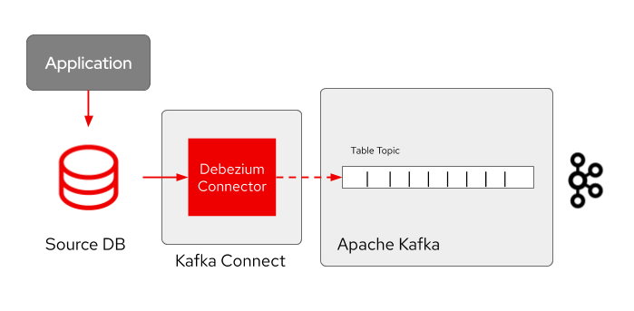

// versions
:debezium: 1.1
:streams: 1.5
:camel-kafka-connectors: 0.4.0

// URLs
//:fuse-documentation-url: https://access.redhat.com/documentation/en-us/red_hat_fuse/{fuse-version}/
:openshift-console-url: {openshift-host}/dashboards

// attributes
:title: Introducing Debezium
:standard-fail-text: Verify that you followed all the steps. If you continue to have issues, contact your administrator.

// id syntax is used here for the custom IDs
[id='debezium-basic-demo']
= {title}

// Description text for the Solution Pattern.
This tutorial demonstrates how to use Debezium to monitor a MySQL database. As the data in the database changes, you will see the resulting event in AMQ streams.

// Additional introduction content.
In this tutorial you will start the Debezium services in Red Hat OpenShift, run a MySQL database server with a simple example database, and use Debezium to monitor the database for changes.

Debezium is a distributed platform that turns your existing databases into event streams, so applications can see and respond immediately to each row-level change in the databases.

Debezium is built on top of Apache Kafka and provides Kafka Connect compatible connectors that monitor specific database management systems. Debezium records the history of data changes in Kafka logs, from where your application consumes them. This makes it possible for your application to easily consume all of the events correctly and completely. Even if your application stops unexpectedly, it will not miss anything: when the application restarts, it will resume consuming the events where it left off.

Debezium includes multiple connectors. In this tutorial, you will use the MySQL connector. The example database, a one node Kafka cluster and a Kafka Connect cluster with the MySQL connector are already deployed in the working namespace.

[type=walkthroughResource,serviceName=openshift]
.Red Hat OpenShift
****
* link:{openshift-console-url}[Console, window="_blank"]
* link:https://docs.openshift.com/dedicated/4/welcome/index.html/[OpenShift Documentation, window="_blank"]
* link:https://blog.openshift.com/[OpenShift Blog, window="_blank"]
****
// <-- END OF SOLUTION PATTERN GENERAL INFO -->

// <-- START OF SOLUTION PATTERN TASKS -->
[time=5]
[id='title-of-task']
== Task Title

// Subtasks are not required.
// For simple walkthroughs, create your procedure under tasks.

=== Subtask Title

. Do first step.
. Do second step.

[type=verification]
====
Did it work?
====

[type=verificationFail]
{standard-fail-text}
// <-- END OF SOLUTION PATTERN TASKS -->