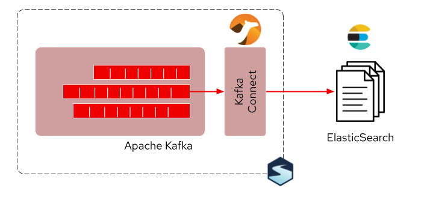
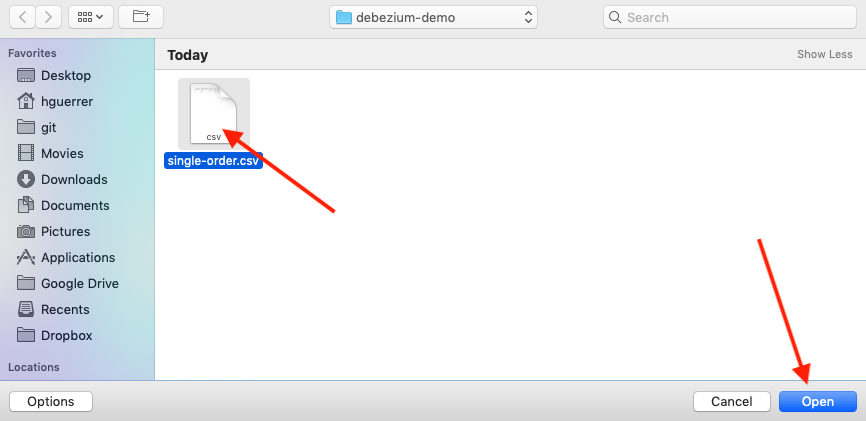
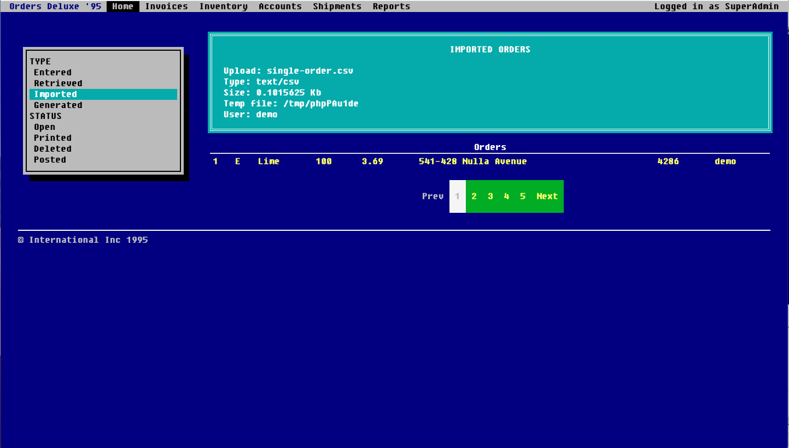
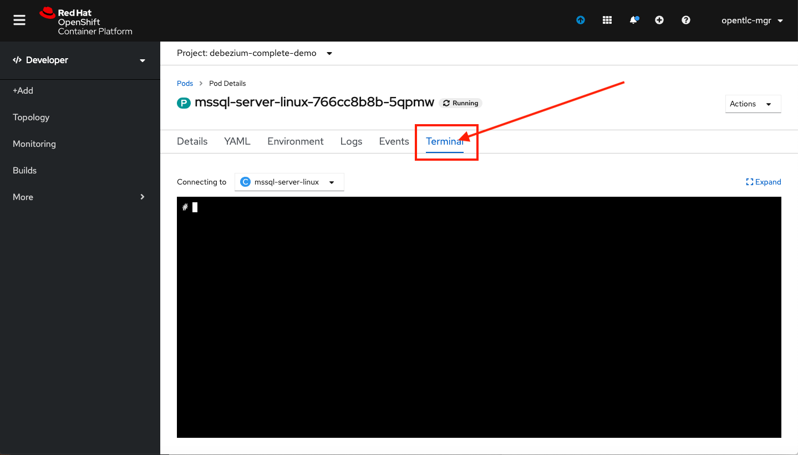
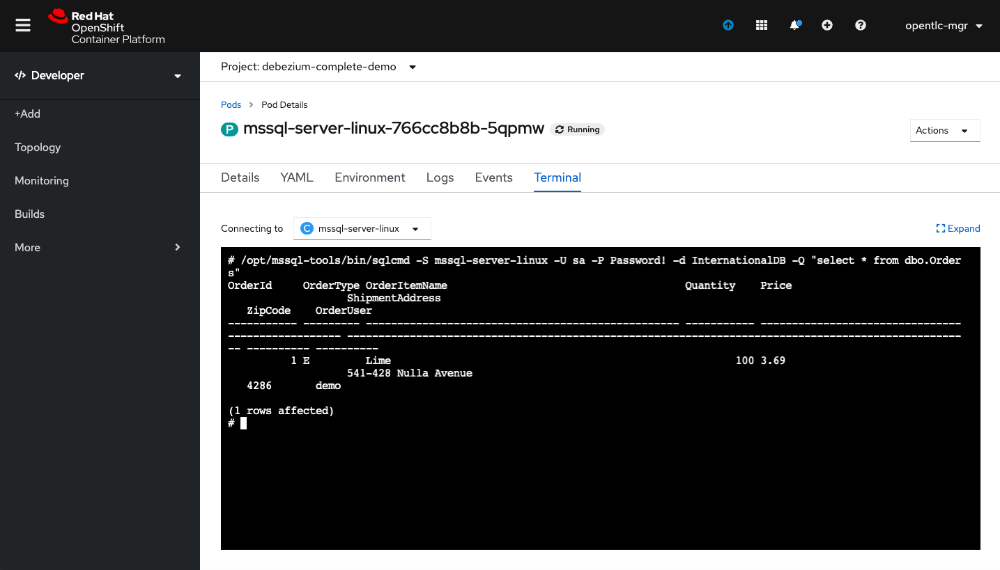
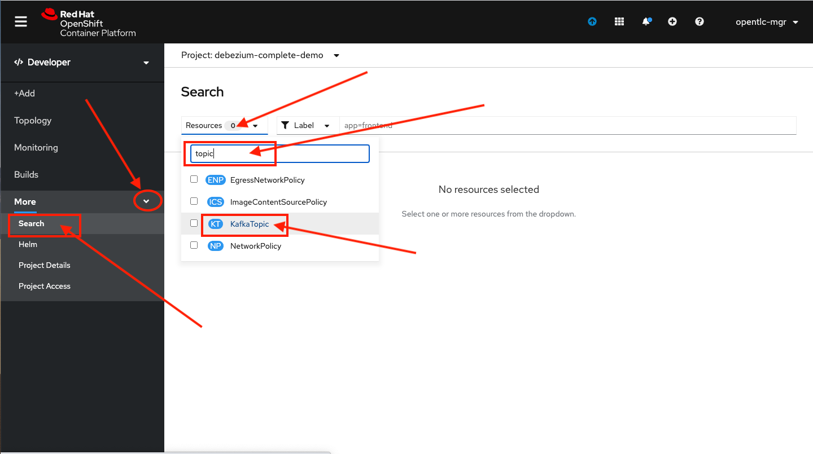
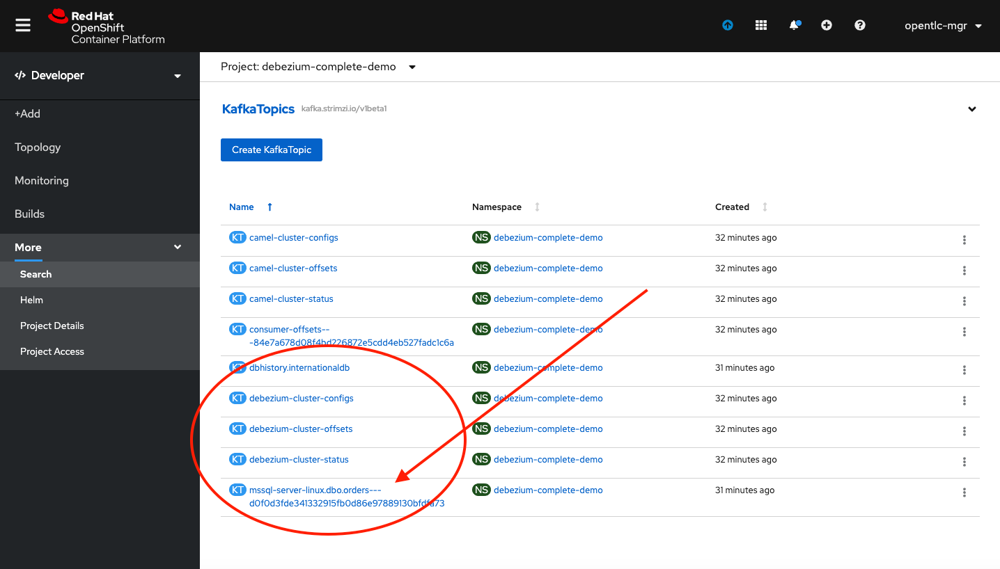

// versions
:debezium: 1.1
:streams: 1.5
:camel-kafka-connectors: 0.4.0

// URLs
//:fuse-documentation-url: https://access.redhat.com/documentation/en-us/red_hat_fuse/{fuse-version}/
:openshift-console-url: {openshift-host}/topology/ns/debezium-complete-demo/graph

// attributes
:title: Data Replication
:standard-fail-text: Verify that you followed all the steps. If you continue to have issues, contact your administrator.

// id syntax is used here for the custom IDs
[id='debezium-complete-demo']
= {title}

// Description text for the Solution Pattern.
In this tutorial you will use the MS SQL Server Debezium connector to emit events from a legacy application to replicate _orders_ data to ElasticSearch for future indexing.

// Additional introduction content.
In the first part of this lab you will use the already enabled Change Data Capture (CDC) for a legacy application that loads the customer orders from a comma separated value (CSV) file. This old PHP application can't be modified so there is no way to modernize it without risks. You will use CDC on the SQL server database where the orders are stored and the connector deployed on the Kafka Connect cluster using AMQ streams to emit data change events.

image::images/debezium-complete-cdc.png[Data replication - CDC]

In the second part of this tutorial, you will use the new Apache Camel Kafka Connectors to easily plug the events generated by debezium into an ElasticSearch index. The orders then will be indexed and stored for further retrieval.

[type=walkthroughResource,serviceName=openshift]
.Red Hat OpenShift
****
* link:{openshift-console-url}[Console, window="_blank"]
****
// <-- END OF SOLUTION PATTERN GENERAL INFO -->

// <-- START OF SOLUTION PATTERN TASKS -->
[time=5]
[id='loading-orders']
== Loading Orders

It’s now time to test the Change Data Capture integration.

- We will first load the CSV data into MSSQL using a PHP app
- Debezium will populate data from MSSQL into the Kafka topic

=== Loading Orders File

Debezium’s SQL Server Connector can monitor and record the row-level changes in the schemas of a SQL Server database.

The functionality of the connector is based upon the change data capture feature provided by SQL Server Standard (since SQL Server 2016 SP1) or Enterprise edition.

. Download to your local system the link:https://raw.githubusercontent.com/RedHatWorkshops/dayinthelife-streaming/master/support/module-1/single-order.csv[Single Order File].

. Navigate to the legacy PHP link:https://www-php-app-debezium-complete-demo.{{openshift-app-host}[Enterprise System] in a new browser tab.
+
image:images/www-main.png[Main Application]

. Click on the *Choose File* button to load the _orders_ file.
+
image:images/www-choose-file.png[Choose File]

. Load the _CSV_ file you just downloaded. Click on the *Open* button.
+

. Now, click the *Load File* button. This will load the file orders and insert them in the database.
+
image:images/www-load-file.png[Load File]

.  Wait a few seconds for the information to load. If this is successfully completed, you will see the CSV data on the *Imported Orders* page.
+

[type=verification]
Were you able to get the orders list screen?

[type=verificationFail]
{standard-fail-text}

// <-- END OF SOLUTION PATTERN GENERAL INFO -->

// <-- START OF SOLUTION PATTERN TASKS -->
[time=5]
[id='check-database-orders']
== Check Database Records

After loading the file into the system, the orders data  should be stored in the SQL Server database. Let's check to make sure that's the case.

. Open a new browser tab and go to the link:{openshift-console-url}[topology view, window="_blank"]
+
[NOTE]
====
If you haven't done so, change from the Administrator to the Developer view on the top left menu.
====

. Click on the database deployment to open the overview page. Then click on the *Resources* tab and next the _Pod_ name.
+
image:images/openshift-db-overview.png[Access Pod]

. Now, click on the *Terminal* tab to access the pod's shell.
+

. Run the following command to access the database:
+
[source,bash,subs="attributes+"]
----
/opt/mssql-tools/bin/sqlcmd -S mssql-server-linux -U sa -P Password! -d InternationalDB -Q "select top 5 * from dbo.Orders where OrderUser='{user-username}'"
----

. Check the results, should look like this:
+

[type=verification]
Is there a record in the database?

[type=verificationFail]
{standard-fail-text}

// <-- END OF SOLUTION PATTERN GENERAL INFO -->

// <-- START OF SOLUTION PATTERN TASKS -->
[time=5]
[id='check-kafka-topics']
== Check Apache Kafka

We checked that the database had the orders data. Is now time to check that the Change Data Capture connector was able to query the transaction log and generate the Apache Kafka events to the cluster.

=== Check the Kafka Topics

. Validate that the *KafkaTopics* were created.
+
--
- Expand the *Advanced* menu on the left menu bar.
- Click on *Search* to load the _resources_ search page.
- Click on the _Resource Type_ field and type 'topic'.
- Finally select *KafkaTopic*.

[TIP]
====
This an alternative way to search for resources in the OpenShift developer console.
====
--

. This will display the topics on the _Kafka cluster_. You should be able to locate your `{user-username}-connect-cluster*` as well as the `{user-username}.earth.dbo.orders--*` _KafkaTopics_.
+

[type=verification]
Were you able to see that your Change Data Capture connector has access to Kafka?

[type=verificationFail]
{standard-fail-text}

=== Inspect Kafka records

Time to check what information is flowing into Apache Kafka.

. Go back to the topology view. We will access one of the Kafka brokers.

. Click on the `user kafka` _stateful set_.

. Click on the *Resources* tab.

. Click on the `user-kafka-0` pod to access the details.
+
image::images/openshift-kafka-deployment.png[Kafka Pods]

. Click on the *Terminal* tab to access this pod's shell.
+
image::images/openshift-kafka-terminal.png[Kafka Pods]
+
[IMPORTANT]
====
Red Hat provides its own complete Apache Kafka distribution container images. We will use the `kafka-console-consumer.sh` script to query the topics.
====

. Issue the following command to read *all* the events in the `orders` topic:
+
[source,bash,subs="attributes+"]
----
bin/kafka-console-consumer.sh --bootstrap-server localhost:9092 --topic {user-username}.db.dbo.Orders --from-beginning
----

. You should see the json output of the messages. Something like this:
+
----
...
{"type":"string","optional":true,"field":"change_lsn"},{"type":"string","optional":true,"field":"commit_lsn"}],"optional":false,"name":"io.debezium.connector.sqlserver.Source",
"field":"source"},{"type":"string","optional":false,"field":"op"},{"type":"int64","optional":true,"field":"ts_ms"}],"optional":false,"name":"user1.earth.dbo.Orders.Envelope"},
"payload":{"before":null,"after":{"OrderId":1000,"OrderType":"E","OrderItemName":"Mocha Irish Cream","Quantity":168,"Price":"4.30","ShipmentAddress":"P.O. Box 511, 4483 Ornare Rd.",
"ZipCode":"C5X 6L8","OrderUser":"user1"},"source":{"version":"0.10.0.Beta2-redhat-00001","connector":"sqlserver","name":"user1.earth","ts_ms":1584993092410,"snapshot":"false",
"db":"InternationalDB","schema":"dbo","table":"Orders","change_lsn":"00000027:00000038:0002","commit_lsn":"00000027:00000038:0003"},"op":"c","ts_ms":1584993096494}}
----

. Copy the string from the terminal.

. Open in a new browser tab `https://jsonformatter.org/json-pretty-print`.

. Paste in the left side and click on Make Pretty so you can check the actual format of the message json payload.

. You will be able to see the `schema` field and the `payload` field.

. Under the _payload_ check you can see there is no `before` value as this was just an *insert* operation. The value should be `null`.

. Type in some `Enter` keystrokes in the Kafka terminal to make space to separate the next record coming to the Topic.

[type=verification]
Were you able to see the structure of debezium records?

[type=verificationFail]
{standard-fail-text}

. Do first step.
. Do second step.

[type=verification]
====
Did it work?
====

[type=verificationFail]
{standard-fail-text}
// <-- END OF SOLUTION PATTERN TASKS -->