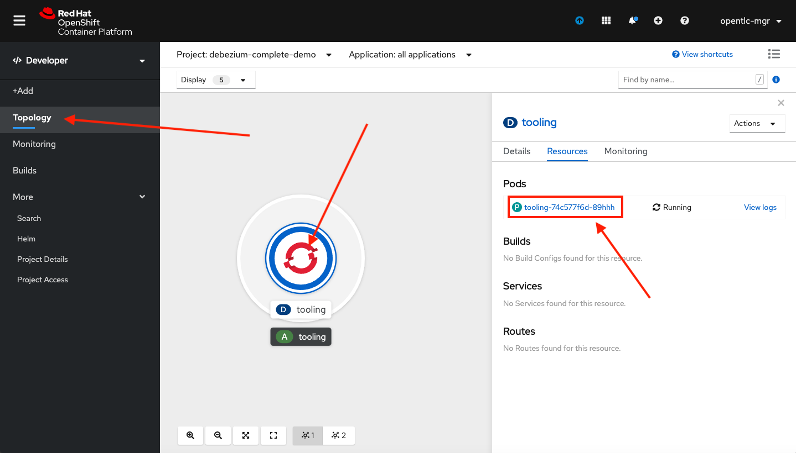
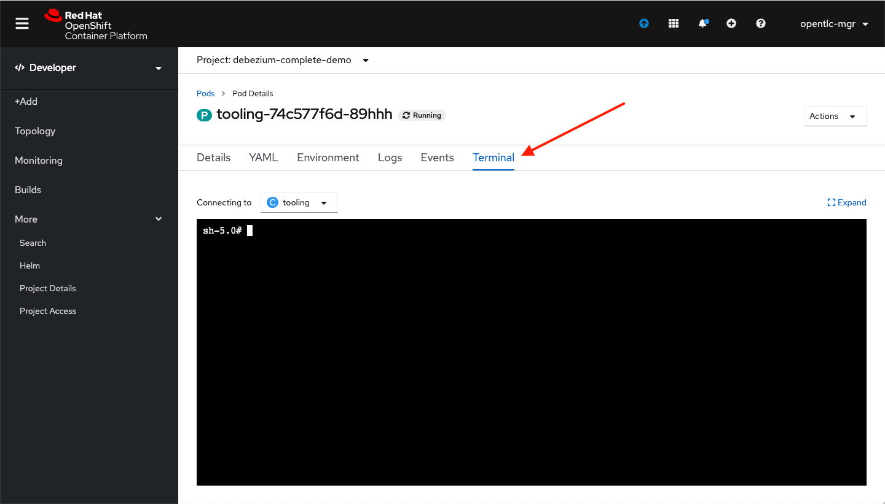
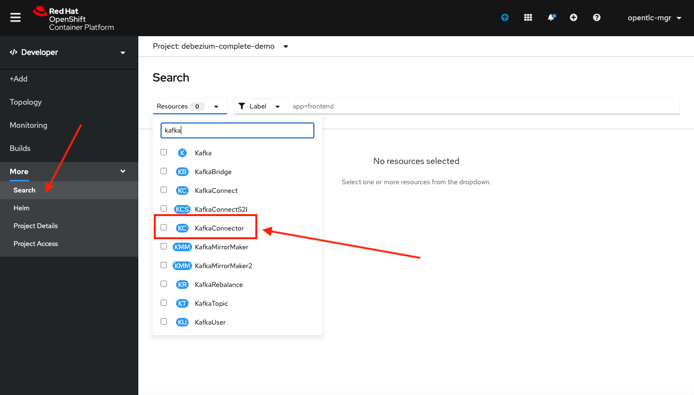
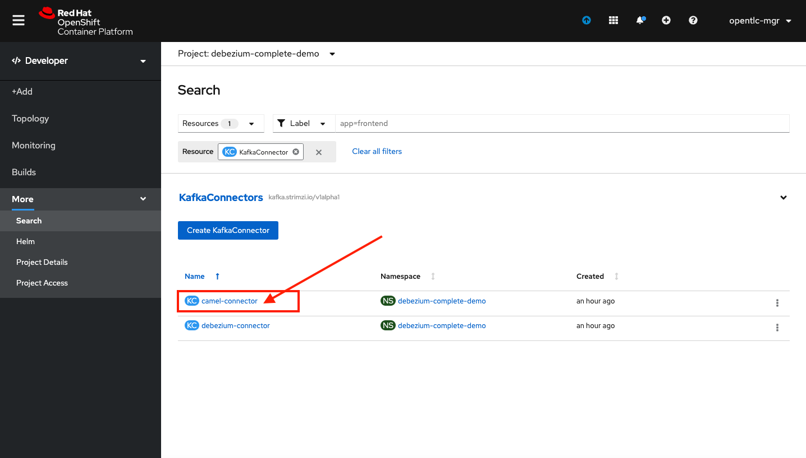
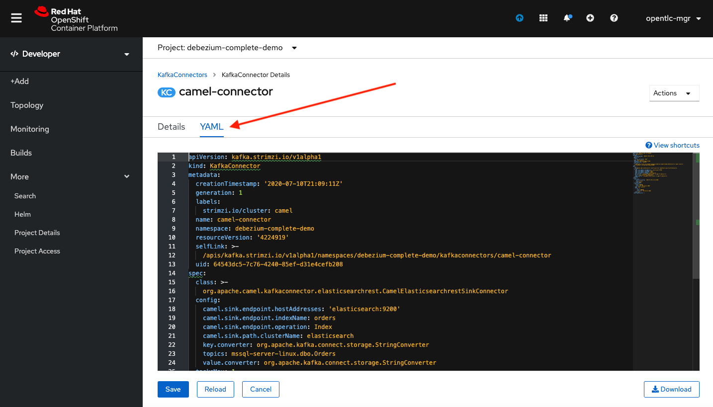

// versions
:debezium: 1.1
:streams: 1.5
:camel-kafka-connectors: 0.4.0

// URLs
//:fuse-documentation-url: https://access.redhat.com/documentation/en-us/red_hat_fuse/{fuse-version}/
:openshift-console-url: {openshift-host}/topology/ns/debezium-complete-demo/graph

// attributes
:title: Data Replication
:standard-fail-text: Verify that you followed all the steps. If you continue to have issues, contact your administrator.

// id syntax is used here for the custom IDs
[id='debezium-complete-demo']
= {title}

// Description text for the Solution Pattern.
In this tutorial you will use the MS SQL Server Debezium connector to emit events from a legacy application to replicate _orders_ data to Elasticsearch for future indexing.

// Additional introduction content.
In the first part of this lab you will use the already enabled Change Data Capture (CDC) for a legacy application that loads the customer orders from a comma separated value (CSV) file. This old PHP application can't be modified so there is no way to modernize it without risks. You will use CDC on the SQL server database where the orders are stored and the connector deployed on the Kafka Connect cluster using AMQ streams to emit data change events.

image::images/debezium-complete-cdc.png[Data replication - CDC]

In the second part of this tutorial, you will use the new Apache Camel Kafka Connectors to easily plug the events generated by debezium into an Elasticsearch index. The orders then will be indexed and stored for further retrieval.

image::images/debezium-complete-es.png[Data replication - Elasticsearch]

[type=walkthroughResource,serviceName=openshift]
.Red Hat OpenShift
****
* link:{openshift-console-url}[Console, window="_blank"]
****
// <-- END OF SOLUTION PATTERN GENERAL INFO -->

// <-- START OF SOLUTION PATTERN TASKS -->
[time=5]
[id='loading-orders']
== Loading Orders

[type=taskResource]
.Useful Resources
****
* link:https://raw.githubusercontent.com/RedHatWorkshops/dayinthelife-streaming/master/support/module-1/single-order.csv[Single Order File Download, window="_blank"]
* link:https://www-php-app-debezium-complete-demo.{openshift-app-host}[Legacy System Application, window="_blank"]
****

It’s now time to test the Change Data Capture integration.

- We will first load the CSV data into MSSQL using a PHP app
- Debezium will populate data from MSSQL into the Kafka topic

=== Loading Orders File

Debezium’s SQL Server Connector can monitor and record the row-level changes in the schemas of a SQL Server database.

The functionality of the connector is based upon the change data capture feature provided by SQL Server Standard (since SQL Server 2016 SP1) or Enterprise edition.

. Download to your local system the link:https://raw.githubusercontent.com/RedHatWorkshops/dayinthelife-streaming/master/support/module-1/single-order.csv[Single Order File, window="_blank"].

. Navigate to the legacy PHP link:https://www-php-app-debezium-complete-demo.{openshift-app-host}[Enterprise System, window="_blank"] in a new browser tab.
+
image:images/www-main.png[Main Application]

. Click on the *Choose File* button to load the _orders_ file.
+
image:images/www-choose-file.png[Choose File]

. Load the _CSV_ file you just downloaded. Click on the *Open* button.
+
image:images/www-orders-file.png[Orders File]

. Now, click the *Load File* button. This will load the file orders and insert them in the database.
+
image:images/www-load-file.png[Load File]

.  Wait a few seconds for the information to load. If this is successfully completed, you will see the CSV data on the *Imported Orders* page.
+
image::images/www-imported-orders.png[Imported Orders]

[type=verification]
Were you able to get the orders list screen?

[type=verificationFail]
{standard-fail-text}

// <-- END OF SOLUTION PATTERN GENERAL INFO -->

// <-- START OF SOLUTION PATTERN TASKS -->
[time=5]
[id='check-database-orders']
== Check Database Records

After loading the file into the system, the orders data  should be stored in the SQL Server database. Let's check to make sure that's the case.

. Open a new browser tab and go to the link:{openshift-console-url}[topology view, window="_blank"]
+
[NOTE]
====
If you haven't done so, change from the Administrator to the Developer view on the top left menu.
====

. Click on the database deployment to open the overview page. Then click on the *Resources* tab and next the _Pod_ name.
+
image:images/openshift-db-overview.png[Access Pod]

. Now, click on the *Terminal* tab to access the pod's shell.
+
image:images/openshift-db-terminal.png[Pod Terminal]

. Run the following command to access the database:
+
[source,bash,subs="attributes+"]
----
/opt/mssql-tools/bin/sqlcmd -S mssql-server-linux -U sa -P Password! -d InternationalDB -Q "select * from dbo.Orders"
----

. Check the results, should look like this:
+
image::images/openshift-sqlcommand.png[Query]

[type=verification]
Is there a record in the database?

[type=verificationFail]
{standard-fail-text}

// <-- END OF SOLUTION PATTERN GENERAL INFO -->

// <-- START OF SOLUTION PATTERN TASKS -->
[time=5]
[id='check-kafka-topics']
== Check Apache Kafka

We checked that the database had the orders data. Is now time to check that the Change Data Capture connector was able to query the transaction log and generate the Apache Kafka events to the cluster.

=== Check the Kafka Topics

. Validate that the *KafkaTopics* were created.
+
--
- Expand the *More* menu on the left menu bar.
- Click on *Search* to load the _resources_ search page.
- Click on the _Resources_ field and type `topic`.
- Finally select *KafkaTopic*.

image::images/openshift-search-kafkatopics.png[Search KafkaTopics]

[TIP]
====
This an alternative way to search for resources in the OpenShift developer console.
====
--

. This will display the topics on the _Kafka cluster_. You should be able to locate your `debezium-cluster*` as well as the `mssql-server-linux.dbo.orders--*` _KafkaTopics_.
+
image::images/openshift-cdc-topics.png[CDC KafkaTopics]

[type=verification]
Were you able to see that your Change Data Capture connector has access to Kafka?

[type=verificationFail]
{standard-fail-text}

=== Inspect Kafka records

Time to check what information is flowing into Apache Kafka.

. Go back to the link:{openshift-console-url}[topology view, window="_blank"]
+
[NOTE]
====
If you haven't done so, change from the Administrator to the Developer view on the top left menu.
====

. Click on the `tooling` pod to open the right panel and then click on the pod name.
+

. Click on the `terminal` tab to get access to the working terminal.
+

. Issue the following command to read the _events_ in the `orders` topic:
+
[source,bash,subs="attributes+"]
----
kafkacat -b demo-kafka-bootstrap:9092 -t mssql-server-linux.dbo.Orders -e | jq .
----

. You should see the json output of the messages. Something like this:
+
----
% Auto-selecting Consumer mode (use -P or -C to override)
% Reached end of topic mssql-server-linux.dbo.Orders [0] at offset 1: exiting
{
  "OrderId": 1,
  "OrderType": "E",
  "OrderItemName": "Lime",
  "Quantity": 100,
  "Price": "3.69",
  "ShipmentAddress": "541-428 Nulla Avenue",
  "ZipCode": "4286",
  "OrderUser": "demo",
  "__op": "c",
  "__table": "Orders"
}
----

[IMPORTANT]
====
This is a reduced version of the debezium record structure. In this case we are using some of the Debezium embedded Single Message Transformation (SMTs) to _extract_ only the information of the *after* payload section and to add the required headers to detect from which table (`pass:[__table]`) is this record coming as well as the operation type (`pass:[__op]`). 

You can take a look at the *KafkaConnector* configuration to check how the SMTs are being used.
====

[type=verification]
Were you able to see the debezium record with the same information from the database insert?

[type=verificationFail]
{standard-fail-text}
// <-- END OF SOLUTION PATTERN GENERAL INFO -->

// <-- START OF SOLUTION PATTERN TASKS -->
[time=5]
[id="send-events-out"]
== Sending events out of Kafka to Elasticsearch

The link:https://camel.apache.org/[Apache Camel] community introduced recently a new subproject in the ecosystem: link:https://camel.apache.org/camel-kafka-connector/latest/[Camel Kafka Connector]. The main idea behind the project is reusing the Camel components’ flexibility in a simple way, through a configuration file mixing Kafka Connect configuration and Camel route definitions and options.

The Camel Kafka Connector allows you to use all Camel components as Kafka Connect connectors, which as result expands Kafka Connect compatibility to include all Camel components to be used in Kafka ecosystem.

image::images/debezium-complete-es.png[Data replication - Elasticsearch]

One of the main reasons to generate Kafka events from the Orders SQL server database is being able to share the information with other systems. In this case, the order fullfillment team requires to search the orders to find _business critical_ information. 

=== Review the Apache Camel Elasticsearch connector

. Go back to the link:{openshift-console-url}[topology view, window="_blank"]
+
[NOTE]
====
If you haven't done so, change from the Administrator to the Developer view on the top left menu.
====

. Review the *KafkaConnector* Custom Resource (CR).
+
--
- Expand the *More* menu on the left menu bar.
- Click on *Search* to load the _resources_ search page.
- Click on the _Resources_ field and type `kafka`.
- Finally select *KafkaConnector*.

[IMPORTANT]
====
Double check that you are selecting *KafkaConnector* and not _KafkaConnect_. Notice the *or* at the end.
====
--

. Click on the `camel-connector`
+

. Click on the _YAML_ tab to access the connector CR configuration.
+

. You should notice the CR spec containing the following configuration:
+
----
  class: >-
    org.apache.camel.kafkaconnector.elasticsearchrest.CamelElasticsearchrestSinkConnector
  config:
    camel.sink.endpoint.hostAddresses: 'elasticsearch:9200'
    camel.sink.endpoint.indexName: orders
    camel.sink.endpoint.operation: Index
    camel.sink.path.clusterName: elasticsearch
    key.converter: org.apache.kafka.connect.storage.StringConverter
    topics: mssql-server-linux.dbo.Orders
    value.converter: org.apache.kafka.connect.storage.StringConverter
  tasksMax: 1
----

[type=verification]
Were you able to see the debezium record with the same information from the database insert?

[type=verificationFail]
{standard-fail-text}
// <-- END OF SOLUTION PATTERN TASKS -->