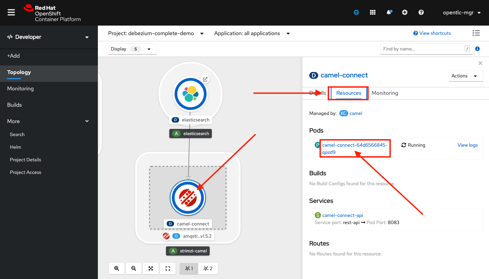
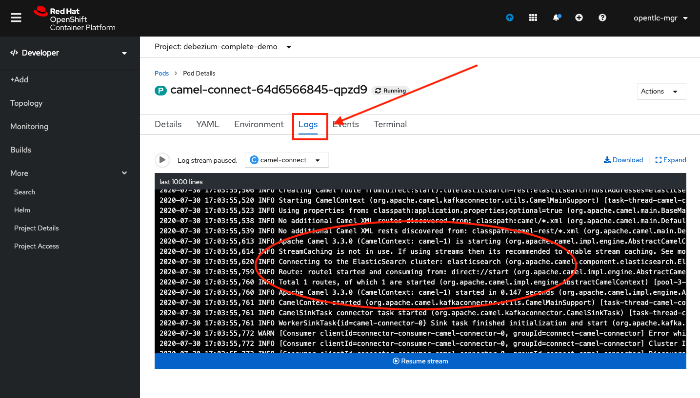

// versions
:debezium: 1.1
:streams: 1.5
:camel-kafka-connectors: 0.4.0

// URLs
//:fuse-documentation-url: https://access.redhat.com/documentation/en-us/red_hat_fuse/{fuse-version}/
:openshift-console-url: {openshift-host}/topology/ns/debezium-complete-demo?view=graph

// attributes
:title: Data replication
:standard-fail-text: Verify that you followed all the steps. If you continue to have issues, contact your administrator.

// id syntax is used here for the custom IDs
[id='debezium-complete-demo']
= {title}

// Description text for the Solution Pattern.
In this tutorial we'll use the Debezium SQL Server Connector to emit events from the database of a legacy PHP application and replicate ordering data to Elasticsearch for future indexing.
Debezium is already deployed for us.

// Additional introduction content.
Our first task is to use Debezium for a legacy application that loads customer orders from a comma-separated value (CSV) file. 
Our legacy PHP application can't be modified, so there is no way to modernize it without risks. 
We'll connect Debezium to the SQL Server database that stores orders.
The connector is deployed on the Kafka Connect cluster and uses AMQ Streams to emit data change events.

image::images/debezium-complete-cdc.png[Data replication - CDC]

In the second part of this tutorial, we'll then use the new Apache Camel Kafka Connectors to easily plug the events generated by Debezium into an Elasticsearch index. 
Elasticsearch can then index the orders and store them for later retrieval.

image::images/debezium-complete-es.png[Data replication - Elasticsearch]

[type=walkthroughResource,serviceName=openshift]
.Red Hat OpenShift
****
* link:{openshift-console-url}[Console, window="_blank"]
****
// <-- END OF SOLUTION PATTERN GENERAL INFO -->

// <-- START OF SOLUTION PATTERN TASKS -->
[time=5]
[id='loading-orders']
== Loading orders

[type=taskResource]
.Useful resources
****
* link:https://raw.githubusercontent.com/RedHat-Middleware-Workshops/dayinthelife-streaming/master/support/module-2/single-order.csv[Single Order File Download, window="_blank"]
* link:https://www-php-app-debezium-complete-demo.{openshift-app-host}[Legacy System Application, window="_blank"]
****

OK, let's get started. To test the Debezium integration, we'll complete the following tasks:

- Load CSV data into a SQL Server database from our PHP application.
- Use Debezium to populate data from our SQL Server database into a Kafka topic.

image::images/debezium-complete-cdc.png[Data replication - CDC]

=== Loading a file that contains a single order

The Debezium SQL Server Connector can capture and record row-level changes in the schema of a SQL Server database.

The functionality of the connector is based on the change data capture feature provided by SQL Server Standard Edition (since SQL Server 2016 SP1) or Enterprise edition.

. Download the order file (`single-order.csv`): right-click the following link, click *Save As*, and then save the file to any location: 
+
link:https://raw.githubusercontent.com/RedHat-Middleware-Workshops/dayinthelife-streaming/master/support/module-2/single-order.csv[single-order file download, window="_blank"]

. Click the following link to open the legacy PHP application in a new browser tab: link:https://www-php-app-debezium-complete-demo.{openshift-app-host}[Enterprise System, window="_blank"].
+
image:images/www-main.png[Main Application]

. Click *Choose File*.
+
image:images/www-choose-file.png[Choose File]
. Select the file that you downloaded in Step 1, navigate to the directory where you want to save it, and then click *Open*.
+
image:images/www-orders-file.png[Orders File]

. Click *Load File* to import the order that the file contains and insert it into the database.
+
image:images/www-load-file.png[Load File]

.  After a few seconds the imported file loads and the *Imported Orders* page displays the order information from the file.
+
image::images/www-imported-orders.png[Imported Orders]

[type=verification]
Were you able to get the orders list screen?

[type=verificationFail]
{standard-fail-text}

// <-- END OF SOLUTION PATTERN GENERAL INFO -->

// <-- START OF SOLUTION PATTERN TASKS -->
[time=5]
[id='check-database-orders']
== Checking the database records

After the file is loaded, the orders data from it should be stored in the SQL Server database. Let's check to make sure that's the case.

. Open a new browser tab and go to the link:{openshift-console-url}[topology view, window="_blank"]
+
* If don't see the *Topology* view, verify that you are using the `debezium-complete-demo` project.
* If the *Topology* view still doesn't show up, make sure that you switch from the *Administrator* view to the *Developer* view.
. From the topology diagram, click the database deployment to open the overview page.
. Click the *Resources* tab, and then click the pod name, for example, `mssql-server-linux-766cc8b8b-5qpmw`.
+
image:images/openshift-db-overview.png[Access Pod]

. Click the *Terminal* tab to open a shell session to the pod.
+
image:images/openshift-db-terminal.png[Pod Terminal]

. Enter the following command to access the SQL Server database:
+
[source,bash,subs="attributes+"]
----
/opt/mssql-tools/bin/sqlcmd -S mssql-server-linux -U sa -P Password! -d InternationalDB -Q "select * from dbo.Orders"
----

. The command returns a result that looks similar output:
+
image::images/openshift-sqlcommand.png[Query]

[type=verification]
Were you able to see the data that we imported into the database from the CSV file?

[type=verificationFail]
{standard-fail-text}

// <-- END OF SOLUTION PATTERN GENERAL INFO -->

// <-- START OF SOLUTION PATTERN TASKS -->
[time=5]
[id='check-kafka-topics']
== Checking Apache Kafka

In the previous task, we checked that the database had the orders data. 
Not let's check that the Debezium connector is able to query the transaction log and generate Apache Kafka events to the cluster.

=== Validating that the Kafka topics were created

. From the OpenShift console, click *More* in the console menu to expand the submenu.
. Click *Search* to load the resources *Search* page.
. Click the *Resources* field, and in the *Select Resource* field, type `topic`.
. From the list of resources, click *KafkaTopic*.

image::images/openshift-search-kafkatopics.png[Search KafkaTopics]

[TIP]
====
This an alternative way to search for resources in the OpenShift developer console.
====
--

. From the list of topics in the Kafka cluster, locate the `debezium-cluster*` topics and the`mssql-server-linux.dbo.orders--*` topic.
+
--
image::images/openshift-cdc-topics.png[CDC KafkaTopics]

[NOTE]
====
Don't worry about that awful long name! The GUID that is generated is only for the OpenShift custom resource management. 
The _actual_ topic name is a bit friendlier.
====
--

[type=verification]
Were you able to see that your Debezium connector has access to Kafka?

[type=verificationFail]
{standard-fail-text}

=== Inspecting Kafka records

Now let's check to see what information is flowing into Apache Kafka.

. Go back to the link:{openshift-console-url}[topology view, window="_blank"]
. Verify that you are using the `debezium-complete-demo` project, and that you are using the *Developer* view.
. From the topology diagram, click the circle for the *tooling* application to open the overview page.
. Click the *Resources* tab, and then click the pod name, for example, `tooling-74c577f6d-89hhh`.
+
image::images/tooling-topology.png[Tooling, role="integr8ly-img-responsive"]

. Click the *Terminal* tab to open a shell session to the pod.
+
image::images/tooling-terminal.png[Tooling terminal, role="integr8ly-img-responsive"]

. Enter the following command to view the events in the `orders` topic:
+
[source,bash,subs="attributes+"]
----
kafkacat -b demo-kafka-bootstrap:9092 -t mssql-server-linux.dbo.Orders -e | jq .
----
+
The command returns the event message in the topic, in JSON format, as in the following sample output:
+
[source,json]
----
% Auto-selecting Consumer mode (use -P or -C to override)
% Reached end of topic mssql-server-linux.dbo.Orders [0] at offset 1: exiting
{
  "OrderId": 1,
  "OrderType": "E",
  "OrderItemName": "Lime",
  "Quantity": 100,
  "Price": "3.69",
  "ShipmentAddress": "541-428 Nulla Avenue",
  "ZipCode": "4286",
  "OrderUser": "demo",
  "__op": "c",
  "__table": "Orders"
}
----

[NOTE]
====
The preceding example shows a reduced version of the Debezium record structure. 
The example reflects modifications that are carried out by applying embedded Debezium Single Message Transformations (SMTs). 
The SMTs process the original content of the record and modify it by carrying out the following tasks: 

* Extract from the topic only the information in the `after` payload section.
* Specify to only return data for designated operations (`"__op": "c"`). 
* Detect the name of the table (`"__table: "Orders"`) that is the source of the record.

You can see the SMTs that are used by looking at the *KafkaConnector* configuration.
====

[type=verification]
Were you able to see the Debezium record that resulted when our legacy application imported the CSV file into the database?

[type=verificationFail]
{standard-fail-text}
// <-- END OF SOLUTION PATTERN GENERAL INFO -->

// <-- START OF SOLUTION PATTERN TASKS -->
[time=5]
[id="send-events-out"]
== Delivering Kafka events to Elasticsearch

Recently, the link:https://camel.apache.org/[Apache Camel] community introduced the link:https://camel.apache.org/camel-kafka-connector/latest/[Camel Kafka Connector] project. 
The main idea behind the project is to exploit the flexibility of Camel components by combining a Kafka Connect configuration and Camel route definitions and options in a single configuration file.

With the Camel Kafka Connector, the Kafka ecosystem becomes compatible with the full range of Camel components.
That is, any Camel component can be used as a Kafka Connect connector. 

image::images/debezium-complete-es.png[Data replication - Elasticsearch]

A primary use case for generating Kafka events from a database is to share information with other systems. 
For example, in our scenario, our organization's Order Fulfillment team needs the ability to search the information in the _Orders_ database for business critical information. 

=== Reviewing the Apache Camel Elasticsearch connector

. Go back to the link:{openshift-console-url}[topology view, window="_blank"]
. Verify that you are using the `debezium-complete-demo` project, and that you are using the *Developer* view.
. Review the *KafkaConnector* Custom Resource (CR).
.. Expand the *More* menu in the console menu panel.
.. Click *Search* to load the resources *Search* page.
.. Click the *Resources* field, and then type `kafka` in the *Select Resource* field.
.. From the list of resources, click *KafkaConnector*.

image::images/openshift-search-kafkaconnectors.png[Search KafkaConnectors]

[IMPORTANT]
====
Be sure that you click *KafkaConnector* and not *KafkaConnect*. Notice the _or_ at the end of the word.
====
--

. From the list of connectors, click `camel-connector`
+
image::images/openshift-camel-connector.png[Camel Connector]

. Click the *YAML* tab to view the CR configuration for the connector.
+
image::images/openshift-connector-detail.png[Connector Detail]

. In the CR `spec`, notice the following configuration:
+
[source,yaml]
----
spec:
  class: >-
    org.apache.camel.kafkaconnector.elasticsearchrest.CamelElasticsearchrestSinkConnector
  config:
    camel.sink.endpoint.hostAddresses: 'elasticsearch:9200'
    camel.sink.endpoint.indexName: orders
    camel.sink.endpoint.operation: Index
    camel.sink.path.clusterName: elasticsearch
    key.converter: org.apache.kafka.connect.storage.StringConverter
    topics: mssql-server-linux.dbo.Orders
    value.converter: org.apache.kafka.connect.storage.StringConverter
  tasksMax: 1
----
+
The configuration includes settings that are required for the Camel component to work, for example, adding endpoint fields such as `hostAddresses`, `indexName` and `operation`. 
In our case, we will index all of the orders that are emitted from the database.

. Scroll down to check the status of the Connector. It should look similar to the following example:
+
[source,yaml]
----
status:
  conditions:
    - lastTransitionTime: '2020-07-30T17:03:55.382Z'
      status: 'True'
      type: Ready
  connectorStatus:
    connector:
      state: RUNNING
      worker_id: '10.131.0.32:8083'
    name: camel-connector
    tasks:
      - id: 0
        state: RUNNING
        worker_id: '10.131.0.32:8083'
    type: sink
  observedGeneration: 1
----
+
The *KafkaConnector* resource in the preceding example provides information about the state of the connector. 
This same information is also available by querying the REST API from the Kafka Connet cluster. 
If the connector is working fine, it should have 1 task and the value in the `state` field should be `RUNNING`.

[type=verification]
Is the connector in the correct state?

[type=verificationFail]
{standard-fail-text}

=== Reviewing the connector log

. Go back to the link:{openshift-console-url}[topology view, window="_blank"]

. In the topology diagram, click the *camel-connect* circle within the *strimzi-camel* cluster to open the overview page. 
. Click the *Resources* tab and then click the pod name to access the running Kafka Connect container.
+

. From the *Pod Details* page, click the *Logs* tab to view the container log.
+

. You should be able to see that the Apache Camel route started successfully. Search for some lines similar to these:
+
----
2020-07-30 17:03:55,486 INFO Setting initial properties in Camel context: [{connector.class=org.apache.camel.kafkaconnector.elasticsearchrest.CamelElasticsearchrestSinkConnector, camel.sink.endpoint.operation=Index, camel.sink.path.clusterName=elasticsearch, camel.sink.component=elasticsearch-rest, task.class=org.apache.camel.kafkaconnector.elasticsearchrest.CamelElasticsearchrestSinkTask, topics=mssql-server-linux.dbo.Orders, tasks.max=1, camel.sink.endpoint.indexName=orders, camel.sink.endpoint.hostAddresses=elasticsearch:9200, name=camel-connector, value.converter=org.apache.kafka.connect.storage.StringConverter, key.converter=org.apache.kafka.connect.storage.StringConverter}] (org.apache.camel.kafkaconnector.utils.CamelMainSupport) [task-thread-camel-connector-0]
2020-07-30 17:03:55,506 INFO Creating Camel route from(direct:start).to(elasticsearch-rest:elasticsearch?hostAddresses=elasticsearch:9200&indexName=orders&operation=Index) (org.apache.camel.kafkaconnector.utils.CamelMainSupport) [task-thread-camel-connector-0]
2020-07-30 17:03:55,520 INFO Starting CamelContext (org.apache.camel.kafkaconnector.utils.CamelMainSupport) [task-thread-camel-connector-0]
2020-07-30 17:03:55,523 INFO Using properties from: classpath:application.properties;optional=true (org.apache.camel.main.BaseMainSupport) [pool-3-thread-1]
2020-07-30 17:03:55,538 INFO No additional Camel XML routes discovered from: classpath:camel/*.xml (org.apache.camel.main.DefaultRoutesCollector) [pool-3-thread-1]
2020-07-30 17:03:55,539 INFO No additional Camel XML rests discovered from: classpath:camel-rest/*.xml (org.apache.camel.main.DefaultRoutesCollector) [pool-3-thread-1]
2020-07-30 17:03:55,613 INFO Apache Camel 3.3.0 (CamelContext: camel-1) is starting (org.apache.camel.impl.engine.AbstractCamelContext) [pool-3-thread-1]
2020-07-30 17:03:55,614 INFO StreamCaching is not in use. If using streams then its recommended to enable stream caching. See more details at http://camel.apache.org/stream-caching.html (org.apache.camel.impl.engine.AbstractCamelContext) [pool-3-thread-1]
2020-07-30 17:03:55,620 INFO Connecting to the ElasticSearch cluster: elasticsearch (org.apache.camel.component.elasticsearch.ElasticsearchProducer) [pool-3-thread-1]
2020-07-30 17:03:55,759 INFO Route: route1 started and consuming from: direct://start (org.apache.camel.impl.engine.AbstractCamelContext) [pool-3-thread-1]
2020-07-30 17:03:55,760 INFO Total 1 routes, of which 1 are started (org.apache.camel.impl.engine.AbstractCamelContext) [pool-3-thread-1]
2020-07-30 17:03:55,760 INFO Apache Camel 3.3.0 (CamelContext: camel-1) started in 0.147 seconds (org.apache.camel.impl.engine.AbstractCamelContext) [pool-3-thread-1]
2020-07-30 17:03:55,761 INFO CamelContext started (org.apache.camel.kafkaconnector.utils.CamelMainSupport) [task-thread-camel-connector-0]
2020-07-30 17:03:55,761 INFO CamelSinkTask connector task started (org.apache.camel.kafkaconnector.CamelSinkTask) [task-thread-camel-connector-0]
----

[type=verification]
Did the connector start successfully?

[type=verificationFail]
{standard-fail-text}
// <-- END OF SOLUTION PATTERN TASKS -->

// <-- START OF SOLUTION PATTERN TASKS -->
[time=5]
[id='index-result']
== Checking the indexed data on Elasticsearch

Now that we verified that the Apache Camel Kafka Connector is running in the Kafka Connect cluster, let's look at the Elasticsearch REST API to check whether our data was successfully indexed.

[type=taskResource]
.Useful resources
****
* link:https://raw.githubusercontent.com/RedHat-Middleware-Workshops/dayinthelife-streaming/master/support/module-2/earth-orders.csv[Multiple Orders File Download, window="_blank"]
* link:https://www-php-app-debezium-complete-demo.{openshift-app-host}[Legacy System Application, window="_blank"]
* link:http://elastic-debezium-complete-demo.{openshift-app-host}/orders[Elasticsearch REST endpoint, window="_blank"]
****

=== Reviewing the index information

. In a new browser tab, navigate to the Elasticsearch index link:http://elastic-debezium-complete-demo.{openshift-app-host}/orders[REST endpoint, window="_blank"].
+ 
A page loads and retrieves a JSON object with information about the _mapping properties_ of the orders that we submitted to the PHP application. 
The page displays content that is similar to the following output (formatted for readability):
+
[source,json]
----
{
  "orders": {
    "aliases": {},
    "mappings": {
      "properties": {
        "OrderId": {
          "type": "long"
        },
        "OrderItemName": {
          "type": "text",
          "fields": {
            "keyword": {
              "type": "keyword",
              "ignore_above": 256
            }
          }
        },
        "OrderType": {
          "type": "text",
          "fields": {
            "keyword": {
              "type": "keyword",
              "ignore_above": 256
            }
          }
        },
        "OrderUser": {
          "type": "text",
          "fields": {
            "keyword": {
              "type": "keyword",
              "ignore_above": 256
            }
          }
        },
        "Price": {
          "type": "text",
          "fields": {
            "keyword": {
              "type": "keyword",
              "ignore_above": 256
            }
          }
        },
        "Quantity": {
          "type": "long"
        },
        "ShipmentAddress": {
          "type": "text",
          "fields": {
            "keyword": {
              "type": "keyword",
              "ignore_above": 256
            }
          }
        },
        "ZipCode": {
          "type": "text",
          "fields": {
            "keyword": {
              "type": "keyword",
              "ignore_above": 256
            }
          }
        },
        "__op": {
          "type": "text",
          "fields": {
            "keyword": {
              "type": "keyword",
              "ignore_above": 256
            }
          }
        },
        "__table": {
          "type": "text",
          "fields": {
            "keyword": {
              "type": "keyword",
              "ignore_above": 256
            }
          }
        }
      }
    },
    "settings": {
      "index": {
        "creation_date": "1596135798546",
        "number_of_shards": "1",
        "number_of_replicas": "1",
        "uuid": "1k0svQD0R6iOrGQBgK2LgA",
        "version": {
          "created": "7030099"
        },
        "provided_name": "orders"
      }
    }
  }
}
----

=== Searching the index

Now let's search the index to retrieve all of the records that are available. 

. Append the following string to the URL path: `/_search` and press Enter.

. The result that appears in the browser window should look like the following example (formatted here for readability):
+
[source,json]
----
{
  "took": 41,
  "timed_out": false,
  "_shards": {
    "total": 1,
    "successful": 1,
    "skipped": 0,
    "failed": 0
  },
  "hits": {
    "total": {
      "value": 1,
      "relation": "eq"
    },
    "max_score": 1,
    "hits": [
      {
        "_index": "orders",
        "_type": "_doc",
        "_id": "OcsboXMBOET50gSsdxHl",
        "_score": 1,
        "_source": {
          "OrderId": 1,
          "OrderType": "E",
          "OrderItemName": "Lime",
          "Quantity": 100,
          "Price": "3.69",
          "ShipmentAddress": "541-428 Nulla Avenue",
          "ZipCode": "4286",
          "OrderUser": "demo",
          "__op": "c",
          "__table": "Orders"
        }
      }
    ]
  }
}
----

[type=verification]
Does the order information match what we imported into our legacy application?

[type=verificationFail]
{standard-fail-text}

=== Loading more orders

. Return to the legacy link:https://www-php-app-debezium-complete-demo.{openshift-app-host}[Enterprise System, window="_blank"].
+
image:images/www-main.png[Main Application]

. Download the link:https://raw.githubusercontent.com/RedHat-Middleware-Workshops/dayinthelife-streaming/master/support/module-2/earth-orders.csv[Mutiple Orders File, window="_blank"], `earth-orders.csv`.

. Load the file into the application. The file loads 1000 more orders into the system.
+
image:images/www-load-multiple-file.png[Main Application]

. After the file finishes loading, the *Imported Orders* page displays the data from the file.
+
--
image:images/www-imported-multiple-orders.png[Main Application]

[TIP]
=====
Refer to the steps in Task 2.1 and 3.1 for the instructions about how to query the database and check the Kafka topic.
=====
--

[type=verification]
Do you see the data from the CSV file that we loaded to the legacy application?

[type=verificationFail]
{standard-fail-text}

=== Searching orders

. Return to the browser tab where you have the `/_search` URL and refresh it. 
Elasticsearch now returns all of the records. 
The refreshed page displays the updated order information.  
The results should be similar to the following excerpt (formatted here for readability):
+
[source,json]
----
{
  "took": 412,
  "timed_out": false,
  "_shards": {
    "total": 1,
    "successful": 1,
    "skipped": 0,
    "failed": 0
  },
  "hits": {
    "total": {
      "value": 1001,
      "relation": "eq"
    },
    "max_score": 1,
    "hits": [
      {
        "_index": "orders",
        "_type": "_doc",
        "_id": "OcsboXMBOET50gSsdxHl",
        "_score": 1,
        "_source": {
          "OrderId": 1,
          "OrderType": "E",
          "OrderItemName": "Lime",
          "Quantity": 100,
          "Price": "3.69",
          "ShipmentAddress": "541-428 Nulla Avenue",
          "ZipCode": "4286",
          "OrderUser": "demo",
          "__op": "c",
          "__table": "Orders"
        }
      },
...
----

. Notice that this time we received a total of 1001 hits!

=== Searching the index for `Cherry`

We saw that we a search can return all of the records that the database emits, but what if we want to see just a subset?
Let's try filtering our search results by one of the fields. 
To do that, we'll search for all of the orders that are `Cherry`-flavored by targeting only records where the value of `OrderItemName` is set to `Cherry`.

. Append the following query detail to the URL `?q=OrderItemName:Cherry` and press Enter.

. The query returns results that are similar to the following excerpt (formatted here for readability):
+
[source,json]
----
{
  "took": 26,
  "timed_out": false,
  "_shards": {
    "total": 1,
    "successful": 1,
    "skipped": 0,
    "failed": 0
  },
  "hits": {
    "total": {
      "value": 34,
      "relation": "eq"
    },
    "max_score": 3.9419897,
    "hits": [
      {
        "_index": "orders",
        "_type": "_doc",
        "_id": "QctToXMBOET50gSsUxFM",
        "_score": 3.9419897,
        "_source": {
          "OrderId": 9,
          "OrderType": "E",
          "OrderItemName": "Cherry",
          "Quantity": 140,
          "Price": "4.42",
          "ShipmentAddress": "Ap #781-1741 Sem. St.",
          "ZipCode": "130336",
          "OrderUser": "demo",
          "__op": "c",
          "__table": "Orders"
        }
      },
...
----

As you can see, the search query now returns only *34* orders for the item `Cherry`. 

Try using the same query pattern to search the index for other fields.

Congratulations! You successfully replicated data from your legacy application to an indexing service using Red Hat Integration with Debezium, Apache Kafka, and Apache Camel!

[type=verification]
Do your results match those in the preceding example?

[type=verificationFail]
{standard-fail-text}

// <-- END OF SOLUTION PATTERN TASKS -->

// <-- START OF SOLUTION PATTERN TASKS -->
[time=5]
[id='summary']
== Summary

After completing the tutorial, consider the following next steps:

- Explore the tutorial further.
+
Use the MySQL command line client to add, modify, and remove rows in the database tables, and see how the changes affect the topics. 
Keep in mind that you cannot remove rows that are referenced by a foreign key.

- Plan a Debezium deployment.
+
====
You can install Debezium on OpenShift or on Red Hat Enterprise Linux. For more information, see the Debezium installation documentation:

- link:https://access.redhat.com/documentation/en-us/red_hat_integration/2020-Q2/html-single/installing_change_data_capture_on_openshift/[Installing Debezium on OpenShift, window="_blank"]
- link:https://access.redhat.com/documentation/en-us/red_hat_integration/2020-Q2/html-single/installing_change_data_capture_on_rhel/[Installing Debezium on RHEL, window="_blank"]
====

// <-- END OF SOLUTION PATTERN TASKS -->
